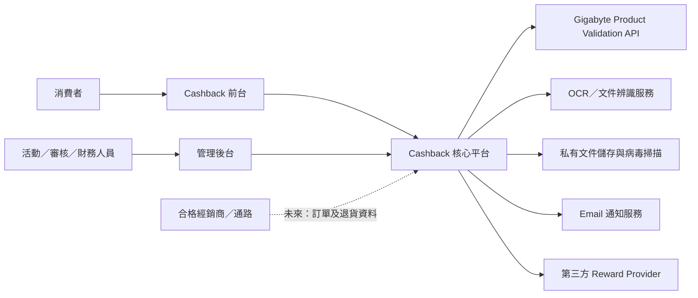
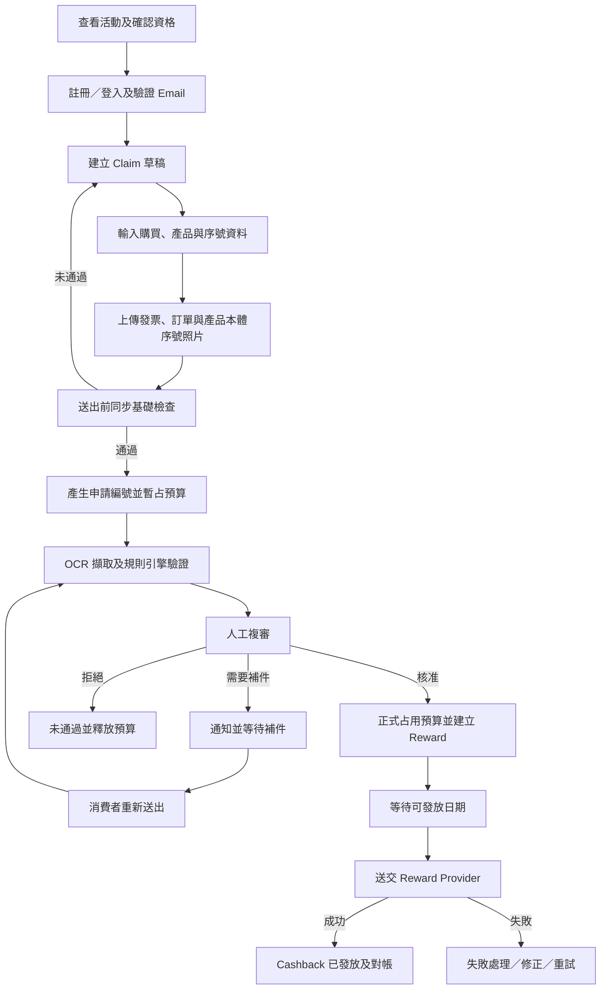
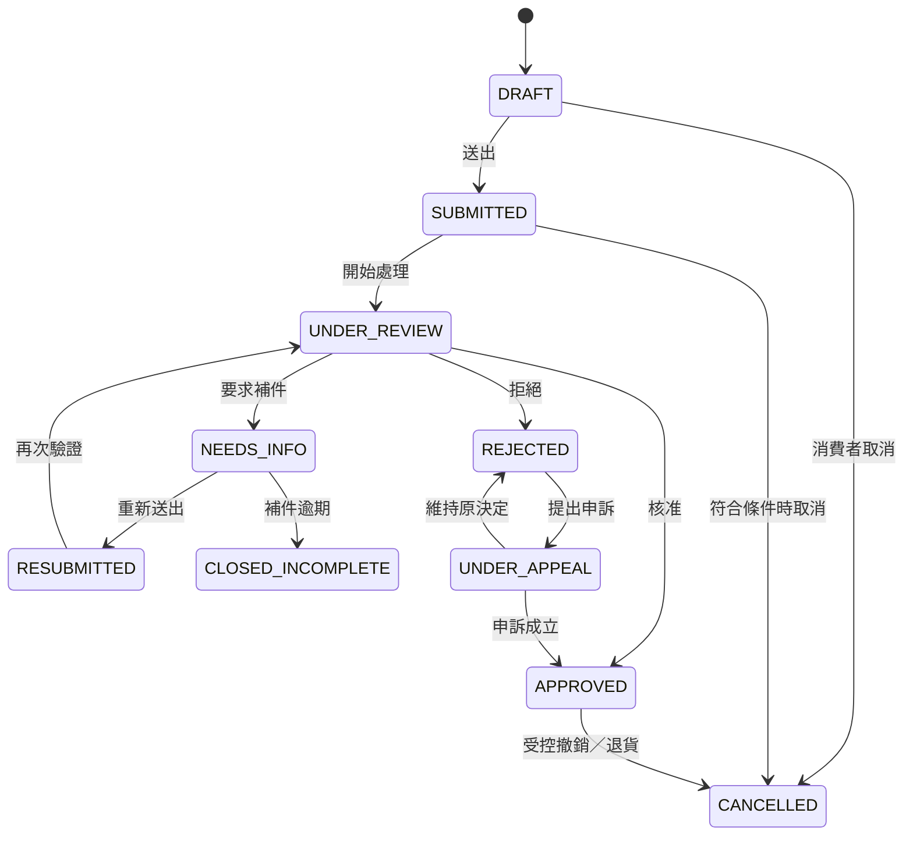
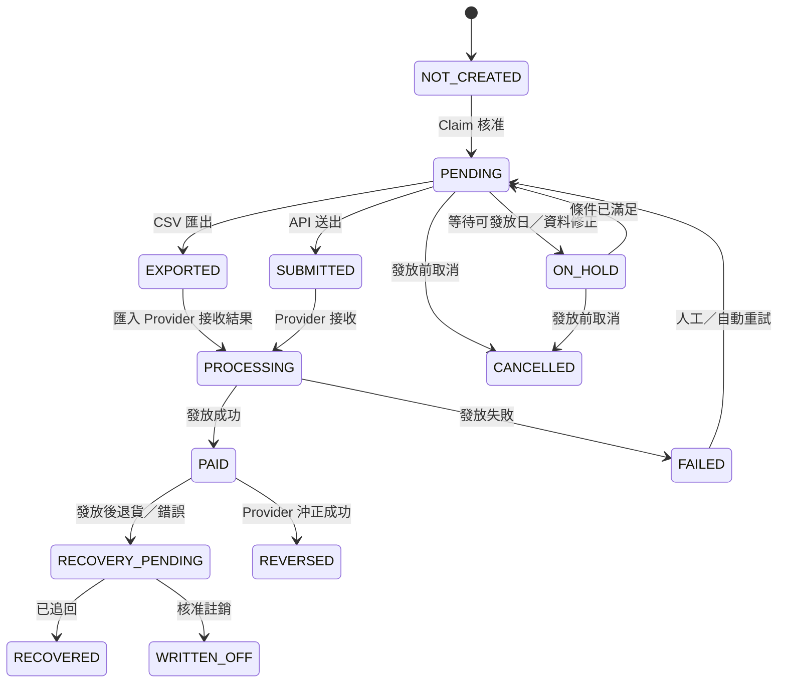
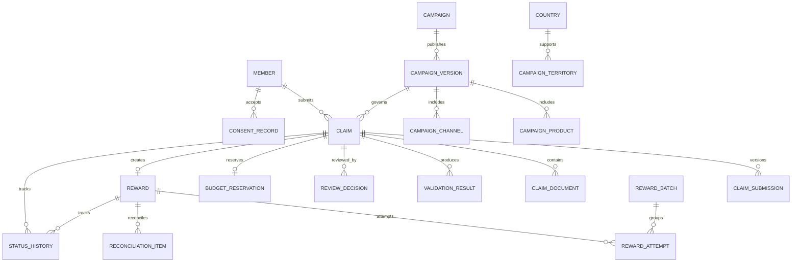

# Gigabyte Cashback 活動平台系統分析文件（SA）

## 1. 文件資訊

| 項目 | 內容 |
|---|---|
| 文件名稱 | Gigabyte Cashback 活動平台系統分析文件 |
| 文件類型 | System Analysis（SA） |
| 文件版本 | 0.2 Draft |
| 建立日期 | 2026-08-05 |
| 適用階段 | MVP 規劃、需求確認、系統設計與開發估算 |
| 文件狀態 | 討論稿，待業務、法務、財務與營運單位確認 |

### 1.1 文件目的

本文件定義 Gigabyte 品牌自營 Cashback 活動平台的業務範圍、使用者角色、核心流程、功能需求、驗證規則、狀態模型、資料模型、外部整合、非功能需求及待確認事項，作為後續 UI/UX、系統設計、API 規格、測試案例及專案估算的共同基礎。

### 1.2 名詞定義

| 名詞 | 說明 |
|---|---|
| Campaign | 一次 Cashback 行銷活動及其資格、期間、產品、通路、預算與回饋規則 |
| Claim | 消費者針對一項產品提出的一筆 Cashback 申請 |
| Campaign Version | 活動發布時形成的不可變更規則版本，供 Claim 保存申請當下的規則快照 |
| Reward | Claim 核准後產生的 Cashback 發放紀錄 |
| Reward Provider | 實際執行銀行轉帳、電子錢包、數位獎勵或其他回饋發放的第三方服務 |
| Proof of Purchase | 發票、正式購買證明或符合活動條款的交易文件 |
| Product Validation API | Gigabyte 既有的產品型號、料號及序號驗證服務 |
| OCR | 從發票、訂單證明及序號照片擷取文字和欄位的辨識服務 |
| Soft Reservation | Claim 通過基本驗證後暫時保留活動預算，尚未成為正式核准支出 |
| Audit Log | 保存重要操作、資料變更、狀態變更與存取行為的稽核紀錄 |

## 2. 專案背景與目標

### 2.1 站台意圖

建立 Gigabyte 品牌自營 Cashback 活動站台，讓消費者在指定期間與指定通路購買符合資格的產品後，提交購買資料、產品序號及證明文件。系統完成自動基礎檢查、OCR 輔助辨識與人工審核後，由第三方 Reward Provider 發放 Cashback，並讓消費者及管理人員查詢完整處理狀態。

本平台不處理商品銷售、購物車、物流或經銷商原始訂單金流。

### 2.2 專案目標

1. 建立可管理多國、多語言、多幣別活動的共用平台。
2. 第一階段以一個歐洲試點國家完成端到端 MVP。
3. 降低人工收件、重複申請與人工對帳成本。
4. 透過產品 API、文件辨識與人工複審提高資格判斷品質。
5. 確保每一筆申請、審核決策與發放結果均可追蹤及稽核。
6. 將 Reward Provider 隔離於核心業務模型之外，以便未來更換供應商或擴充發放方式。

### 2.3 成功條件

平台須完成以下閉環：

```text
建立並發布活動
→ 消費者查詢活動資格
→ 建立及送出 Claim
→ 文件辨識與資格驗證
→ 人工審核／補件／拒絕
→ 核准並產生 Reward
→ 第三方完成 Cashback 發放
→ 系統完成對帳
→ 消費者與管理人員查詢完整紀錄
```

## 3. 專案範圍

### 3.1 MVP 範圍

- 一個歐洲試點國家。
- 一至兩種語言。
- 一種活動幣別。
- 一個產品類別及少量指定型號／料號。
- 少量指定購買通路。
- 固定金額 Cashback，依產品設定金額。
- 每筆 Claim 僅申請一項產品。
- 同一張發票可支援多筆不同產品 Claim。
- 每個產品序號在互斥的 Cashback 活動中只能成功取得一次回饋。
- 產品驗證 API 串接。
- OCR 欄位擷取與規則引擎初步檢查。
- 人工作最終審核決策。
- 單一 Reward Provider。
- Provider API 尚未完成時，以 CSV 匯出、匯入及人工對帳替代。
- Email 通知。
- 響應式網站，不開發原生 App。

### 3.2 MVP 不包含

- 商品商城、購物車、物流及經銷商訂單金流。
- 積點、會員等級、遊戲化任務及 Affiliate 導購。
- 一筆 Claim 申請多項獨立產品。
- 動態比例、階梯式或依實付價格計算的 Cashback。
- AI 自動作成最終核准或拒絕決策。
- 完全無人工介入的發票 OCR 審核。
- 自建銀行轉帳或跨國匯款能力。
- 完整自動化退貨追蹤。
- 原生 iOS／Android App。

### 3.3 架構預留但非 MVP 啟用

- 多國、多語言、多幣別活動。
- 多個 Reward Provider。
- 活動 Bundle 與一筆 Claim 多項產品。
- 經銷商訂單及退貨資料交換。
- 自動核准、風險模型及詐欺偵測服務。
- 簡訊或行動推播通知。
- 多層主管覆核及高金額特殊簽核。

## 4. 重要假設與限制

| 編號 | 假設／限制 | 狀態 |
|---|---|---|
| A-001 | 系統以支援歐洲多國為資料模型目標，但 MVP 僅開放單一國家 | 已確認方向 |
| A-002 | Gigabyte 已有可驗證產品型號、料號及序號的 API | 已確認 |
| A-003 | 試點國家、語言及幣別尚未最終決定 | TBD |
| A-004 | 合格發票、訂單證明及各通路文件格式尚未盤點 | TBD |
| A-005 | Reward Provider 與實際發放方式尚未選定 | TBD |
| A-006 | 活動設有總預算或總名額限制 | 已確認 |
| A-007 | OCR 僅負責擷取及輔助檢查，不直接作成最終拒絕或核准 | 建議方案 |
| A-008 | Claim 由 OCR／規則引擎初審，再由人工複審 | 已確認方向 |
| A-009 | 預設 Cashback 活動彼此不可疊加，例外須由 Campaign 明確設定 | 建議方案 |
| A-010 | 消費者退貨後即喪失 Cashback 資格 | 建議方案，待法務確認 |

## 5. 使用者角色與權限

### 5.1 外部角色

| 角色 | 主要權限 |
|---|---|
| 訪客 | 選擇國家／語言、查看活動列表、活動詳情、資格產品、通路及條款 |
| 會員／申請人 | 維護帳號、建立草稿、送出 Claim、上傳文件、補件、查詢狀態及通知 |
| Reward 收款人 | 原則上應與申請人及發票個人資料相符；依 Provider 流程提供必要收款資料 |
| 代理商審核人員（候選角色） | 僅在授權國家／區域及指定 Campaign 範圍內檢視與審核 Claim；實際審核層級與可見欄位待確認 |

### 5.2 內部角色

| 角色 | 主要權限 |
|---|---|
| OCR／系統服務 | 擷取文件欄位、執行自動驗證、計算風險提示，不作最終決策 |
| 初審人員 | 檢視 OCR 結果、文件及 API 驗證結果，修正擷取欄位、標記風險 |
| 複審人員 | 核准、拒絕、要求補件、處理重新送出及一般例外 |
| 審核主管 | 撤銷或改變受控案件決策、處理高風險及申訴案件 |
| 活動管理員 | 建立活動、維護規則及主資料、發布活動、查看預算使用情形 |
| 財務／Reward 管理員 | 建立發放批次、匯出／匯入檔案、重試及執行對帳 |
| 客服人員 | 查詢案件、新增客服紀錄、重寄通知；不得直接核准或付款 |
| 系統管理員 | 管理帳號、角色、權限與系統設定；不得默認具有業務核准權 |
| 稽核人員 | 唯讀查詢操作、狀態、資料修改、文件存取與發放紀錄 |

### 5.3 權限原則

- 採 Role-Based Access Control（RBAC）。
- 活動發布、Claim 核准及 Reward 發放應分離權限。
- 系統管理員不得因技術管理權限自動取得財務或業務核准權。
- 敏感欄位依角色遮罩。
- 重要動作須重新驗證、要求原因並寫入 Audit Log。
- MVP 可由同一人員兼任初審及複審，但系統仍需保存兩階段結果；正式政策由營運確認。
- 後台資料存取除角色權限外，須再套用國家／區域／Campaign 資料範圍；不得只依前端選單或畫面隱藏限制資料。
- 外部代理商帳號預設不得跨區查詢、匯出或下載 Claim 與附件，且應採最小必要欄位與敏感資料遮罩。

## 6. 系統情境



## 7. 端到端業務流程

### 7.1 正常流程



### 7.2 補件流程

1. 複審人員選擇標準補件原因並填寫消費者可見說明。
2. 系統設定補件截止時間並發送 Email。
3. Claim 在補件期間繼續保留預算，最長期間由活動設定。
4. 消費者只能修改被允許補正的欄位或文件。
5. 重新送出後建立新一版 Claim Submission，不覆蓋原始資料。
6. 逾期未補件時，自動關閉 Claim 並釋放預算。
7. 最大補件次數由 Campaign 設定；超過後交由人工決定或拒絕。

### 7.3 退貨與換貨流程

- 發放前退貨：取消 Claim 或 Reward，釋放預算並保存原因。
- 發放後退貨：建立 Recovery Case，記錄待追回金額與處理結果。
- 換貨：不得直接覆蓋舊序號，須保存舊、新序號與換貨證明的關聯。
- 保固維修／RMA 不應自動視為退貨，須依案件類型區分。
- MVP 不自動從消費者帳戶扣回款項。

## 8. 功能需求

### 8.1 國家、語言與在地化

| ID | 需求 |
|---|---|
| FR-LOC-001 | 訪客可選擇國家與語言，系統可依瀏覽器或網址提供預設值 |
| FR-LOC-002 | 每個 Campaign 必須指定適用國家、幣別、時區及語言 |
| FR-LOC-003 | 日期、金額、小數位與地址格式應依國家設定顯示 |
| FR-LOC-004 | 不得僅靠 IP 判斷資格；最終須以居住地、購買國及 Campaign 條款判定 |
| FR-LOC-005 | 活動條款與隱私通知須保存語言及版本 |
| FR-LOC-006 | 系統時間資料以 UTC 保存；Campaign 另保存 IANA 時區識別碼，前後台依活動時區顯示 |
| FR-LOC-007 | 活動開始、購買截止、申請截止及補件截止須顯示完整日期、時間、時區名稱與 UTC Offset，不得只顯示日期 |
| FR-LOC-008 | 是否可建立或送出 Claim，應以伺服器時間依適用 Campaign 時區判定；前端倒數僅供提示，不作最終依據 |
| FR-LOC-009 | 系統須明確定義截止秒的包含／不包含規則，並正確處理日光節約時間切換、不存在或重複的當地時間 |

### 8.2 會員與身分驗證

| ID | 需求 |
|---|---|
| FR-MEM-001 | 支援會員註冊、登入、登出及忘記密碼 |
| FR-MEM-002 | Email 驗證完成後才可正式送出 Claim |
| FR-MEM-003 | 同一 Email 原則上只能有一個有效會員帳號 |
| FR-MEM-004 | 會員中心可查看 Claim、補件要求、Reward 狀態及通知紀錄 |
| FR-MEM-005 | Email 或重要個資變更須重新驗證並留下紀錄 |
| FR-MEM-006 | 提供個資查詢、更正、刪除或限制處理的受控申請流程 |

### 8.3 Campaign 管理

| ID | 需求 |
|---|---|
| FR-CAM-001 | 建立、複製、編輯、預覽、發布、暫停、結束及封存 Campaign |
| FR-CAM-002 | 分別設定購買期間、申請期間、補件期限及預計發放 SLA |
| FR-CAM-003 | 設定國家、語言、幣別、時區及活動條款版本 |
| FR-CAM-004 | 設定合格產品類別、型號、料號、通路及 Cashback 金額 |
| FR-CAM-005 | 設定每位會員、每張發票、每個產品群組及整體活動申請上限 |
| FR-CAM-006 | 設定總預算、名額、暫占期限及額滿處理政策 |
| FR-CAM-007 | 設定 Promotion Group 及是否允許與其他活動疊加 |
| FR-CAM-008 | 發布時產生不可變更的 Campaign Version |
| FR-CAM-009 | 已發布活動若需重大修改，應建立新版本並定義生效時間 |
| FR-CAM-010 | Claim 送出時保存適用規則與 Cashback 金額快照 |
| FR-CAM-011 | 活動發布前可關聯公司簽呈／電子簽核單，並保存簽呈編號、核准狀態、核准版本與核准時間 |
| FR-CAM-012 | 系統可依欄位映射從已核准簽呈帶入 Campaign 草稿，候選欄位包含活動名稱、國家／區域、期間、幣別、預算、產品、回饋方式及負責單位 |
| FR-CAM-013 | 簽呈帶入欄位須標示來源且保留匯入紀錄；受管制欄位若與核准內容不一致，應阻擋發布或要求重新簽核，不得靜默覆寫 |
| FR-CAM-014 | 支援依國家／區域建立不同 Campaign 或在同一 Campaign Version 內設定國別規則；採用模式與共用欄位待確認 |
| FR-CAM-015 | 支援單一活動包含多個合格產品，以及指定需同時購買的產品組合、數量、組合關係與回饋計算方式 |
| FR-CAM-016 | 支援「曾購買指定產品」的前置資格條件，並設定產品範圍、購買期間、可接受證明及是否允許同張發票 |
| FR-CAM-017 | 發布前須預覽國家、產品、組合、前置購買條件、時區截止點及預算影響，供活動管理員確認 |

### 8.4 Claim 申請

| ID | 需求 |
|---|---|
| FR-CLM-001 | 會員可建立、暫存、編輯及刪除尚未送出的草稿 |
| FR-CLM-002 | 每筆 Claim 只能包含一項產品及一個序號 |
| FR-CLM-003 | 可輸入購買日期、通路、發票號碼、訂單編號及必要購買資料 |
| FR-CLM-004 | 可輸入產品型號、料號及序號 |
| FR-CLM-005 | 可上傳發票、訂單證明、產品本體序號照片及活動指定文件 |
| FR-CLM-006 | 送出成功時產生不可猜測且唯一的 Claim Number |
| FR-CLM-007 | 送出後不得由消費者任意修改，僅能透過補件流程提交新版本 |
| FR-CLM-008 | 同一張發票可支援多筆不同產品 Claim，不得只因發票號碼重複直接阻擋 |
| FR-CLM-009 | 系統須保存每次 Submission 的資料及文件版本 |
| FR-CLM-010 | 會員可取消尚未進入不可逆發放階段的 Claim，是否釋放序號依規則決定 |

### 8.5 文件管理與 OCR

| ID | 需求 |
|---|---|
| FR-DOC-001 | 限制上傳檔案類型、大小、張數及最低可辨識品質 |
| FR-DOC-002 | 上傳後執行病毒／惡意檔案掃描，未通過前不得提供審核人員開啟 |
| FR-DOC-003 | 文件儲存於私有空間，僅以短效授權網址存取 |
| FR-DOC-004 | OCR 擷取發票號碼、日期、通路、產品、料號、數量、金額、姓名與地址等可用欄位 |
| FR-DOC-005 | OCR 擷取產品本體序號照片中的序號文字 |
| FR-DOC-006 | 每個擷取欄位保存原始值、正規化值、信心分數及模型版本 |
| FR-DOC-007 | 人工可修正 OCR 結果，系統保存修正前後值、操作者及時間 |
| FR-DOC-008 | 原始文件不得因補件或重新辨識而被覆蓋 |
| FR-DOC-009 | 保存文件檢視、下載及刪除紀錄 |

### 8.6 Validation 驗證

系統須執行以下基本檢查：

| ID | 驗證規則 |
|---|---|
| VR-001 | Claim 送出時間位於 Campaign 申請期間 |
| VR-002 | 購買日期位於 Campaign 購買期間 |
| VR-003 | 購買國、會員居住國及通路符合活動地域規則 |
| VR-004 | 產品型號與料號符合 Campaign Version |
| VR-005 | 通路符合 Campaign Version |
| VR-006 | 序號格式正確且 Product Validation API 驗證有效 |
| VR-007 | API 回傳產品資訊與申請的型號／料號相符 |
| VR-008 | 序號未在互斥 Promotion Group 中取得或占用有效 Cashback 資格 |
| VR-009 | 會員未超過申請數量或產品群組上限 |
| VR-010 | 活動尚有可暫占的預算或名額 |
| VR-011 | 必填資料及指定文件完整 |
| VR-012 | 發票號碼、訂單編號或其他特徵若重複，建立風險提示而非一律拒絕 |
| VR-013 | 同張發票所支援的產品數量不得少於其有效 Claim 數量 |
| VR-014 | 發票、申請人及 Reward 收款人資料依活動政策合理一致 |
| VR-015 | Cashback 不得超過條款允許的金額或活動預算 |

驗證結果分為：

- `PASS`：自動檢查通過。
- `WARNING`：可送件，但必須人工確認。
- `FAIL`：無法送件或須由授權人員例外處理。
- `UNAVAILABLE`：外部服務無法完成驗證，案件保留等待重試，不應直接拒絕。

### 8.7 人工審核

| ID | 需求 |
|---|---|
| FR-REV-001 | 提供待處理、已指派、補件中、高風險及逾期案件佇列 |
| FR-REV-002 | 支援案件指派、領取及避免同時決策的審核鎖定 |
| FR-REV-003 | 同畫面顯示申請資料、文件、OCR、API、重複及預算驗證結果 |
| FR-REV-004 | 支援核准、拒絕、要求補件、取消及升級主管處理 |
| FR-REV-005 | 補件與拒絕使用標準 Reason Code，並可增加內部及消費者可見說明 |
| FR-REV-006 | 內部備註不得向消費者顯示 |
| FR-REV-007 | 核准時重新檢查序號、預算及 Claim 狀態，避免併發重複核准 |
| FR-REV-008 | 所有審核決策保存操作者、時間、原因、資料版本及前後狀態 |
| FR-REV-009 | 對拒絕或爭議結果提供客服／主管人工申訴處理能力 |
| FR-REV-010 | 可建立代理商審核角色，並將帳號限制於授權國家／區域及指定 Campaign |
| FR-REV-011 | 代理商只能看到其資料範圍內的工作佇列、Claim、文件及統計；搜尋、直接網址、API 與匯出均須套用相同限制 |
| FR-REV-012 | 代理商可見欄位、文件下載、匯出、補件、核准與拒絕權限須可分別設定，預設採最小權限 |
| FR-REV-013 | Claim 跨區轉派、代理商授權範圍變更及例外存取須經受控流程並寫入 Audit Log |
| FR-REV-014 | 代理商是否可作最終核准，或僅能初審／提出建議，須依 Campaign 或區域政策設定 |

### 8.8 預算與名額管理

| ID | 需求 |
|---|---|
| FR-BUD-001 | Campaign 可設定總預算或總名額 |
| FR-BUD-002 | Claim 通過送出時的基本驗證後建立 Soft Reservation |
| FR-BUD-003 | Claim 核准時將暫占轉為正式占用 |
| FR-BUD-004 | 拒絕、取消或補件逾期時釋放暫占額度 |
| FR-BUD-005 | 預算保留與釋放須以原子操作執行，避免超發 |
| FR-BUD-006 | 後台顯示總額、暫占、核准、已發放、待追回、釋放及剩餘金額 |
| FR-BUD-007 | 額滿後依 Campaign 設定停止收件或進入候補名單 |
| FR-BUD-008 | 消費者端應明示送件不代表最終獲得 Cashback |
| FR-BUD-009 | 若 Campaign 關聯公司簽呈，活動預算不得高於有效核准金額；追加預算須關聯新的核准版本或補充簽呈 |
| FR-BUD-010 | 後台須可對照簽呈核准金額、Campaign 預算、暫占、已核准、已發放及剩餘可用金額，以支援預算治理 |

### 8.9 Reward 發放與對帳

| ID | 需求 |
|---|---|
| FR-RWD-001 | Claim 核准後建立唯一 Reward，不得因重試建立重複有效 Reward |
| FR-RWD-002 | Reward 保存金額、幣別、發放方式、Provider、收款 Token／遮罩資料及可發放日期 |
| FR-RWD-003 | 對 Provider 的每次發送使用唯一 Idempotency Key |
| FR-RWD-004 | 保存 Provider Transaction ID、狀態、時間及失敗原因 |
| FR-RWD-005 | 支援 API、Webhook、CSV 匯出及結果匯入的 Provider Adapter |
| FR-RWD-006 | CSV 匯出須建立不可變更的批次編號及明細快照 |
| FR-RWD-007 | 重複匯入同一結果檔不得造成重複狀態更新或重複發放 |
| FR-RWD-008 | 支援整批成功、部分成功、失敗、重試、取消及沖正結果 |
| FR-RWD-009 | 人工重試須記錄操作者與原因，不得覆蓋前次交易紀錄 |
| FR-RWD-010 | 支援內部金額、Provider 金額及實際成功紀錄的批次對帳 |
| FR-RWD-011 | 對帳差異須建立例外案件，不得自動視為完成 |
| FR-RWD-012 | Provider 最好透過其 Hosted Page 收集銀行或其他敏感收款資料，平台僅保存必要 Token 與遮罩資訊 |

### 8.10 通知

系統至少支援以下 Email 通知：

- Email 驗證及密碼重設。
- Claim 已送出。
- 需要補件及補件即將到期。
- 補件已收到。
- Claim 已核准。
- Claim 未通過。
- Reward 處理中。
- Cashback 已發放。
- 發放失敗或需要修正收款資料。
- Claim 已取消或補件逾期關閉。

通知需求：

- 模板依國家、語言、事件與 Campaign Version 管理。
- 保存收件人、模板版本、發送時間、結果及退信狀態。
- 通知不得包含完整銀行帳戶、文件連結或過量個資。
- Email 僅作通知，會員中心為正式狀態來源。
- 後台依權限可重寄通知，但須留下操作紀錄。

### 8.11 後台查詢、報表與稽核

後台至少支援：

- 依 Claim Number、Email、姓名、序號、發票、訂單、活動、狀態及日期搜尋。
- Claim 申請與處理時間報表。
- 核准、拒絕、補件及 Reason Code 統計。
- 預算暫占、核准、發放、失敗、釋放及待追回報表。
- Reward 批次、交易、重試及對帳差異報表。
- CSV／試算表匯出；匯出動作須受權限控制並寫入 Audit Log。
- 審核員處理量及 SLA 逾期資訊。
- 依活動保存操作、狀態、欄位變更及文件存取紀錄。

## 9. 狀態模型

### 9.1 Campaign 狀態

```text
DRAFT（草稿）
→ SCHEDULED（已排程）
→ ACTIVE（進行中）
→ PAUSED（已暫停，可恢復）
→ ENDED（已結束）
→ ARCHIVED（已封存）
```

- 已發布版本不可直接覆寫。
- 暫停時是否允許已建立草稿送出，須由 Campaign 設定。
- 結束後仍須保留審核、發放、查詢與稽核能力。

### 9.2 Claim 狀態



Claim 狀態與 Reward 狀態必須分開保存，不以單一欄位混合審核與付款流程。

### 9.3 Reward 狀態



### 9.4 狀態變更共同要求

每次狀態變更須保存：

- Entity 類型及 ID。
- 原狀態與新狀態。
- 操作者類型與 ID。
- 發生時間及系統時區。
- Reason Code 與說明。
- 來源（前台、後台、自動工作、API、Webhook、CSV）。
- 關聯 Submission、Campaign Version、Provider Event 或 Batch ID。

## 10. 業務規則

### 10.1 一張發票多項產品

1. MVP 維持一筆 Claim 一項產品。
2. 同一張發票若列有多項合格產品，可建立多筆 Claim。
3. 發票號碼重複僅作為風險訊號，不可單獨作為自動拒絕理由。
4. 系統須核對發票產品數量與該發票支持的有效 Claim 數量。
5. 同一張發票由不同會員使用時，案件必須轉為人工確認。

### 10.2 序號與活動疊加

1. 草稿不占用序號資格。
2. Claim 正式送出時，以資料庫唯一性與交易鎖定保留序號資格。
3. 同一 Promotion Group 中，一個序號只能有一筆有效 Claim。
4. 補件須沿用原 Claim，不建立新的獨立資格占用。
5. 拒絕或取消是否釋放序號，依 Reason Code 與活動規則決定。
6. 不同類型活動若明確允許，可設定為不互斥。

### 10.3 預算先到先得

建議以「通過基本驗證的有效送件時間」作為排序依據：

1. 通過期間、產品 API、序號與基本文件完整性後建立 Soft Reservation。
2. 補件在期限內保留預算。
3. 拒絕、取消或補件逾期即釋放。
4. 核准後成為正式預算占用。
5. 額滿但允許候補時，以原有效送件時間排序遞補。

最終政策仍須由活動業務單位確認。

### 10.4 冷靜期與退貨

1. Claim 可在活動申請期間內立即送出。
2. Reward 須於活動設定的 `eligible_for_payout_at` 之後才可發放。
3. 線上購物的等待日期應考慮實際收貨日，而非只使用發票日。
4. 若無可靠收貨日期，應由業務及法務定義保守等待規則。
5. 消費者退貨後喪失資格，發放後退貨則建立追回案件。
6. 不得將保固換修直接判定為退貨。

## 11. 邏輯資料模型



### 11.1 主要實體

| 實體 | 重要內容 |
|---|---|
| Member | Email、驗證狀態、國家、語言、帳號狀態及必要個資 |
| Country | ISO Code、幣別、時區、語言、地址與資料保存政策 |
| Campaign | 活動識別、名稱、狀態、Promotion Group 及擁有單位 |
| Campaign Version | 購買／申請期間、規則、上限、條款、預算及發布資訊 |
| Campaign Product | 產品型號、料號、產品群組及 Cashback 金額 |
| Campaign Channel | 合格通路代碼、名稱、國家及有效期間 |
| Claim | Claim Number、會員、活動版本、目前狀態、產品與計算金額快照 |
| Claim Submission | 每次送出／補件時的表單資料快照 |
| Claim Document | 文件類型、儲存識別、雜湊、掃描狀態、版本及保存期限 |
| OCR Result | 擷取欄位、原始值、正規化值、信心分數與模型版本 |
| Validation Result | 規則 ID、結果、訊息、外部回應摘要及執行時間 |
| Review Decision | 審核階段、決定、原因、內部備註、消費者說明及操作者 |
| Budget Reservation | 暫占／正式占用金額、狀態、建立及到期時間 |
| Reward | 金額、幣別、方式、Provider、收款 Token、狀態及可發放時間 |
| Reward Attempt | 冪等鍵、交易編號、請求／回應摘要、結果及失敗原因 |
| Reward Batch | CSV 或批次識別、狀態、產生人、檔案雜湊與金額統計 |
| Reconciliation Item | 內部與 Provider 金額／狀態、差異及處理結果 |
| Recovery Case | 已發放後退貨或錯發的待追回金額、狀態及處理紀錄 |
| Consent Record | 條款／隱私版本、語言、同意時間及必要證據 |
| Status History | 所有重要狀態轉移 |
| Audit Log | 登入、查詢、匯出、文件存取、設定及資料修改紀錄 |

### 11.2 唯一性與一致性約束

- Claim Number 全域唯一且不可由流水號直接猜測。
- `Campaign Version + Product/Part Number` 唯一。
- 有效序號占用以 `Promotion Group + Normalized Serial Number` 建立條件式唯一約束。
- 一個 Claim 最多只能有一個有效 Reward。
- 每個 Reward Attempt 的 Idempotency Key 全域唯一。
- 同一 Provider Transaction ID 在同一 Provider 中唯一。
- 預算暫占及核准必須透過資料庫交易確保不超發。
- 原始 Claim Submission、文件及外部 Provider Event 不可被覆蓋。

## 12. 外部系統整合

### 12.1 Product Validation API

預期輸入：

- 國家／市場。
- 產品型號。
- 料號。
- 序號。

預期輸出：

- 序號是否有效。
- 正規化序號。
- 對應型號及料號。
- 市場／出貨區域（若有）。
- 產品狀態或異常旗標（若有）。
- 可供稽核的查詢識別及時間。

整合要求：

- 設定 Timeout、有限次重試及 Circuit Breaker。
- API 無法使用時標記 `UNAVAILABLE` 並排入重試，不得直接拒絕。
- 不在日誌中記錄不必要的完整敏感資料。
- 核准前重新驗證重要結果。
- 保存必要回應摘要，不依賴外部 API 永久保留歷史。

### 12.2 OCR 服務

- OCR 可由外部雲端或內部服務提供，選型須確認 EU 個資處理與資料位置。
- 上傳文件完成惡意檔案掃描後才送 OCR。
- 保存模型版本與信心分數，以便重現及評估品質。
- OCR 低信心或欄位衝突時轉人工，不作自動拒絕。
- 若使用生成式 AI，須限制資料保存、訓練用途及第三方再利用。

### 12.3 Reward Provider

Provider 尚未選定，系統應以 Adapter 隔離。選型至少評估：

- 試點國家、幣別及發放方式覆蓋。
- SEPA／IBAN、電子錢包或其他方式支援。
- Hosted Payout Page 或 Tokenization 能力。
- API、Webhook、CSV 及批次對帳能力。
- Idempotency、重試、取消、沖正及退款能力。
- KYC／AML、制裁名單與失敗責任歸屬。
- GDPR DPA、次處理者、資料位置及跨境傳輸。
- SLA、客服、費用、匯差與最低發放金額。

### 12.4 Email 服務

- 支援交易型 Email、多語言模板、退信及投遞結果。
- 事件必須可重送且保持冪等，不得因工作重試重複寄送多封相同通知。
- 不依賴 Email 作為唯一業務狀態來源。

### 12.5 檔案儲存及安全掃描

- 私有 Object Storage。
- 傳輸及靜態加密。
- Malware Scan 與隔離區。
- 短效簽章 URL。
- 依文件類型及國家政策執行保存與刪除。

### 12.6 公司簽呈／電子簽核系統（候選整合）

整合目的為讓 Campaign 在發布前承接已核准的活動與預算資料，建立「簽呈核准內容 → Campaign Version → 預算使用」的可追溯關係。

預期整合能力：

- 依簽呈編號查詢核准狀態、版本、申請／核准人、核准時間及核准金額。
- 依核准資料帶入 Campaign 草稿；實際可帶入欄位須先完成來源與格式盤點。
- 保存來源系統識別碼、原始值、匯入時間、欄位映射版本及後續變更紀錄。
- 發布前再次確認簽呈仍有效，且受管制欄位與核准版本一致。
- 簽呈撤回、作廢、變更或追加預算時，通知活動管理員並依政策暫停發布、要求重新簽核或建立新 Campaign Version。

整合方式可評估 API、Webhook 或核准資料批次匯入；若簽呈系統無可用介面，MVP 可先採人工輸入簽呈編號及上傳核准附件，但仍須保留雙人覆核與 Audit Log。

## 13. 前台頁面需求

1. 國家／語言選擇。
2. 活動列表。
3. 活動詳情、合格產品、合格通路、FAQ 及條款。
4. 註冊、登入、Email 驗證及忘記密碼。
5. Cashback 申請資格引導。
6. Claim 分步表單。
7. 文件上傳與預覽。
8. 送出前確認及條款同意。
9. 送出成功及 Claim Number。
10. 會員中心／Claim 列表。
11. Claim 詳情、狀態歷程及補件要求。
12. 補件重新上傳。
13. Reward 與發放結果。
14. 個資及帳號設定。
15. 客服／申訴入口。

## 14. 後台頁面需求

1. 登入及 MFA。
2. 儀表板與待辦摘要。
3. Campaign 列表、簽呈關聯／匯入、編輯、預覽、發布與版本。
4. 國家、產品、料號、通路、Reason Code 及通知模板主資料。
5. 預算及名額監控。
6. Claim 搜尋、篩選及匯出。
7. 初審／複審工作佇列。
8. Claim 詳情、文件、OCR、API、風險及歷程整合頁。
9. 補件、核准、拒絕、取消及申訴處理。
10. Reward 待發放佇列。
11. Provider 批次、CSV 匯出／匯入及 API 結果。
12. 發放失敗、重試及收款資料修正。
13. 對帳差異及 Recovery Case。
14. 報表。
15. 使用者、角色與權限。
16. Audit Log 與文件存取紀錄。
17. 代理商帳號與國家／區域／Campaign 授權範圍管理。
18. 簽呈核准金額、Campaign 預算與實際使用金額對照。

## 15. 非功能需求

### 15.1 安全性

- 全站使用 TLS。
- 密碼使用業界標準的強雜湊演算法，不可明文或可逆保存。
- 後台帳號強制 MFA。
- 導入登入、註冊、密碼重設、Claim 送出及上傳限流。
- 對公開表單使用 Bot Protection 或等效控制。
- 防範 OWASP 常見風險，包括注入、XSS、CSRF、SSRF、Broken Access Control。
- 管理後台及文件下載採最小權限。
- Secrets 不得寫入原始碼或一般日誌。
- 定期進行弱點掃描、相依套件更新及滲透測試。

### 15.2 隱私與 GDPR

- 明確定義 Data Controller、Data Processor 與各 Provider 責任。
- 僅收集完成資格審核與發放必要的資料。
- 收集時告知目的、法律依據、保存期限、接收者及跨境傳輸。
- 保存條款與隱私通知的同意版本。
- 提供資料存取、更正、刪除、限制及申訴的處理流程。
- 敏感個資與銀行資料應遮罩並限制存取；優先由 Reward Provider 直接收集。
- OCR／AI 不得單獨作成最終拒絕；保留人工介入與申訴管道。
- 依國家、文件類型、財務與法定需求制定保存及刪除政策。
- 上線前由法務／DPO 評估是否需要 DPIA。

### 15.3 效能

待確認正式 SLA；MVP 初步目標：

- 一般前台頁面在正常網路條件下應提供可接受的互動速度。
- Claim 送出同步檢查應在合理時間內完成，耗時 OCR 改採背景工作。
- 查詢與匯出大量資料應採分頁及非同步產檔。
- Product API、OCR、Email、Provider 服務延遲不得長時間阻塞使用者請求。

### 15.4 可用性與復原

- 外部服務失效時保留案件並支援安全重試。
- 背景工作採至少一次傳遞時，消費端必須實作冪等。
- 建立資料庫與文件備份、復原演練及 RPO/RTO。
- Provider Webhook 支援簽章驗證、重送及事件去重。
- 重要工作提供監控、告警及 Dead Letter Queue 或等效機制。

### 15.5 可稽核性

- Audit Log 應防止一般管理員修改或刪除。
- 所有時間以 UTC 保存，前台依 Campaign 時區顯示。
- 保存 Campaign Version、Claim Submission、審核與 Provider Event 的關聯。
- 匯出檔案保存產生條件、操作者、時間、筆數及檔案雜湊。

### 15.6 可及性與相容性

- 響應式支援桌面、平板及行動瀏覽器。
- 以前台 WCAG 2.1 AA 或組織指定標準為目標。
- 表單錯誤不可只用顏色表達。
- 文件上傳與狀態顯示需支援鍵盤操作及螢幕閱讀器基本語意。

## 16. 異常與例外處理

| 情境 | 建議處理 |
|---|---|
| Product API Timeout | Claim 保留，標記等待驗證並背景重試，不拒絕 |
| OCR 無法辨識 | 轉人工輸入或要求補件 |
| 同序號同時送出 | 以交易及唯一約束只允許一筆成功占用 |
| 活動預算同時額滿 | 以交易鎖定依送出順序暫占，其餘候補或拒絕 |
| Email 發送失敗 | 重試並保留站內正式狀態，不回滾 Claim |
| Provider API Timeout | 先查詢原 Idempotency Key／交易狀態，不直接建立新付款 |
| CSV 重複匯入 | 依 Batch、檔案雜湊及交易 ID 去重 |
| 發放部分成功 | 逐筆更新，不將整批標示為完全成功 |
| 發放後退貨 | 建立 Recovery Case，不刪除或覆蓋已付款紀錄 |
| 管理員誤核准 | 透過受控撤銷流程，不直接修改歷史狀態 |
| 會員刪除帳號 | 依法律與財務保存義務匿名化或限制使用，不破壞稽核關聯 |

## 17. MVP 驗收準則

MVP 至少須通過下列端到端情境：

1. 管理員建立並發布具產品、通路、期間、預算及條款的 Campaign Version。
2. 消費者完成註冊及 Email 驗證。
3. 消費者建立一項產品 Claim、上傳文件並成功送出。
4. 系統驗證期間、產品 API、序號、通路、上限及預算。
5. OCR 擷取文件欄位並顯示信心分數，人工可修正且保留軌跡。
6. 審核人員可要求補件，消費者可在期限內重新送出。
7. 審核人員可核准或拒絕，系統保存操作者、時間、原因及版本。
8. 同一發票可建立多筆不同序號 Claim；同一互斥活動序號不可重複占用。
9. 活動預算不因併發申請而超發，拒絕或逾期可正確釋放。
10. 核准 Claim 可產生唯一 Reward。
11. 財務可匯出待發放 CSV 並匯入成功、失敗及部分成功結果。
12. 重複匯出、重試或結果匯入不會造成重複付款。
13. 消費者可查詢 Claim 與 Reward 狀態並收到重要 Email。
14. 後台可查詢完整狀態、文件、決策、批次及對帳紀錄。
15. 未授權角色不得檢視完整敏感資料、下載文件、核准或發放。

## 18. 待確認事項

### 18.1 上線前必要決策

| 編號 | 問題 | 影響範圍 | 建議負責單位 |
|---|---|---|---|
| TBD-001 | 第一個試點國家、語言、幣別及時區 | 全系統、法務、Provider | 業務／PM |
| TBD-002 | 合格通路清單及各通路可接受的 Proof of Purchase | 表單、OCR、審核 | 業務／營運 |
| TBD-003 | Product Validation API 規格、SLA、回傳欄位及測試環境 | Validation | 內部產品系統團隊 |
| TBD-004 | Reward 發放方式與 Provider | Reward、個資、對帳 | 財務／採購／法務 |
| TBD-005 | 收款人是否必須與發票姓名及會員完全一致 | 驗證、發放 | 法務／財務 |
| TBD-006 | 有效送件或人工核准何者決定先到先得 | 預算、公平性 | 業務／法務 |
| TBD-007 | Soft Reservation 保留天數及補件次數 | 預算、審核 | 營運 |
| TBD-008 | 退貨等待期、收貨日資料來源及發放時點 | Reward、條款 | 法務／營運 |
| TBD-009 | 已發放後退貨的追回政策與執行方式 | 財務、客服 | 法務／財務 |
| TBD-010 | 初審及複審是否必須由不同人員執行 | 權限、流程 | 稽核／營運 |
| TBD-011 | 活動總預算、超額候補及額滿顯示政策 | Campaign、前台 | 業務／財務 |
| TBD-012 | 個資、文件、財務及 Audit Log 保存期限 | GDPR、儲存 | DPO／法務 |
| TBD-013 | 是否排除企業客戶、員工、經銷商及關係人 | 資格、條款 | 法務／業務 |
| TBD-014 | 二手、展示、福利、租賃、贈品及組合商品資格 | Campaign 規則 | 業務 |
| TBD-015 | OCR 服務與資料處理位置 | 技術、GDPR | IT／DPO |
| TBD-016 | 公司簽呈系統名稱、介接方式、可取得欄位、核准狀態及版本規則 | Campaign、整合、稽核 | IT／財務／簽呈系統 Owner |
| TBD-017 | 哪些 Campaign 欄位必須受簽呈控管；欄位差異與簽呈撤回時是否阻擋發布或暫停活動 | Campaign、預算、流程 | 業務／財務／稽核 |
| TBD-018 | 多國活動採「每國一個 Campaign」或「同一 Campaign 下多個國別規則」 | Campaign、報表、權限 | 業務／營運／IT |
| TBD-019 | 多產品活動是任一合格產品、同時購買組合、滿件組合或其他計算方式 | Campaign、Claim、驗證 | 業務／營運 |
| TBD-020 | 「曾購買指定產品」的驗證資料來源、回溯期間、證明文件及跨帳號／跨國匹配規則 | 資格、個資、OCR、Product API | 業務／法務／IT |
| TBD-021 | 代理商參與初審、複審或最終核准的責任邊界及 SLA | 權限、審核、稽核 | 營運／稽核／法務 |
| TBD-022 | 代理商授權範圍以國家、區域、Campaign 或其組合管理，以及可見欄位與下載權限 | 權限、資料隔離、個資 | 營運／IT／DPO |
| TBD-023 | Campaign 各時間點採用的時區、截止秒包含規則及日光節約時間政策 | Campaign、Claim、通知 | 業務／營運／IT |
| TBD-024 | 跨時區後台人員與消費者的顯示方式，以及截止前通知與倒數規則 | 前後台、通知、客服 | UX／營運 |

### 18.2 本次討論建議歸納（2026-08-06）

| 主題 | 業務目的 | 初步需求方向 | 主要待確認事項 |
|---|---|---|---|
| 簽呈與預算治理 | 活動發布前承接公司核准內容，避免未核准活動或預算超支 | 串接公司簽呈、帶入受管制欄位、關聯核准版本、比對核准預算與實際使用 | 簽呈系統介面、管制欄位、差異／撤回處理、MVP 是否先人工覆核 |
| 活動與資格組合 | 支援不同市場與促銷玩法 | 國別活動、多個合格產品、產品組合及曾購指定產品的前置資格 | Campaign 拆分方式、組合計算、歷史購買資料來源與驗證方式 |
| 代理商審核與資料隔離 | 分散審核作業，同時避免跨區資料外洩 | 新增代理商角色，以國家／區域／Campaign 限制工作佇列、查詢、API、附件及匯出 | 代理商審核層級、可見欄位、下載權限、跨區例外流程 |
| 活動時區與截止邊界 | 確保全球活動開始／結束與 Claim 資格判定一致 | UTC 儲存、Campaign 指定 IANA 時區、顯示完整時區、伺服器端判定與 DST 處理 | 使用時區、截止秒規則、通知／倒數及跨時區顯示 |

上述內容目前均為需求候選與設計約束，須完成 TBD-016 至 TBD-024 的業務決策後，才能納入 MVP 或後續階段的正式範圍。

### 18.3 後續建議文件

本 SA 確認後，建議依序產出：

1. Business Rules Catalogue（完整規則表與 Reason Code）。
2. User Story／Use Case 與驗收條件。
3. UI Sitemap、Wireframe 與表單欄位規格。
4. System Design／Solution Architecture。
5. API Specification。
6. Logical／Physical Data Model。
7. Reward Provider 評選表與整合規格。
8. Test Plan、UAT Cases 及資安測試計畫。
9. 隱私影響評估、資料保存政策及正式活動條款。

## 19. 版本紀錄

| 版本 | 日期 | 說明 |
|---|---|---|
| 0.2 | 2026-08-06 | 納入主管與同事討論建議：公司簽呈與預算治理、多國／多產品／前置購買資格、代理商區域審核權限、活動時區與截止邊界 |
| 0.1 | 2026-08-05 | 依初步需求、歐洲 MVP 方向、品牌活動作法討論及補充決策建立初稿 |
